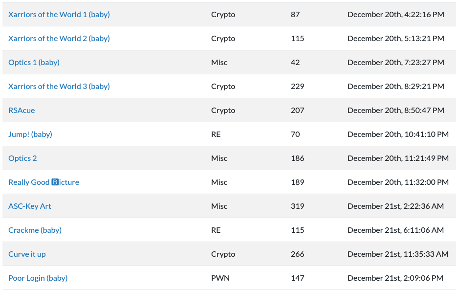

# Overview

[UTC CTF 2019 Teaser](https://ctftime.org/event/948) was a 24 hour online CTF, hosted by several Texas universities. There was no Web category, but I enjoyed the Crypto challenges and they had some cool beginner-friendly stack visualizations in their Pwn challenges!

This time I played on a friend's team, Me&The_Boyz_R_Ready2Hack and we finished 11th out of 241 teams.

# Writeups

- [Curve It Up [Crypto, 266 points]](crypto/curve_it_up/README.md)
- [Really Good (B)icture [Misc, 189 points]](misc/really_good_bicture/README.md)

# Score

