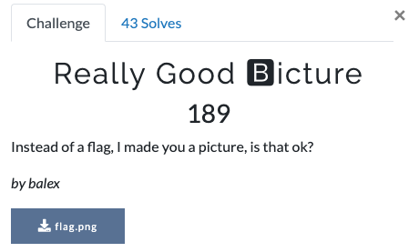

# Problem [Misc, 189 Points]



# Resources

- [Intro to OpenCV](https://opencv-python-tutroals.readthedocs.io/en/latest/py_tutorials/py_gui/py_image_display/py_image_display.html)

# Solution

The included image is below:


This one was pretty straightforward and the solution is hinted at by the problem title. Find the RGB values for each of the 10 colors in the image, convert to ASCII characters and print the flag. Just one minor gimmick that you have to print in BGR order.

```
import cv2

NUM_COLORS = 10

image = cv2.imread('flag.png')
width = image.shape[1]
colors = image[0,0::width//NUM_COLORS,:]

chars = []
for color in colors:
	chars += list(reversed([chr(p) for p in color]))

print(''.join(chars))
```

Flag: `utc{taste_the_re_rainbow94100389}`
