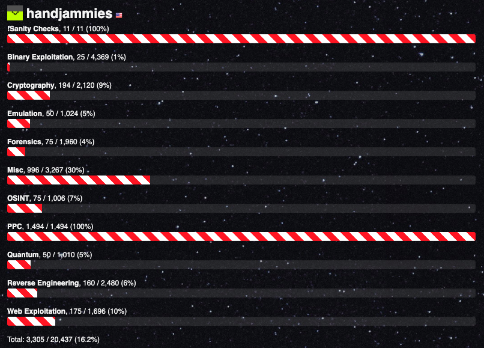
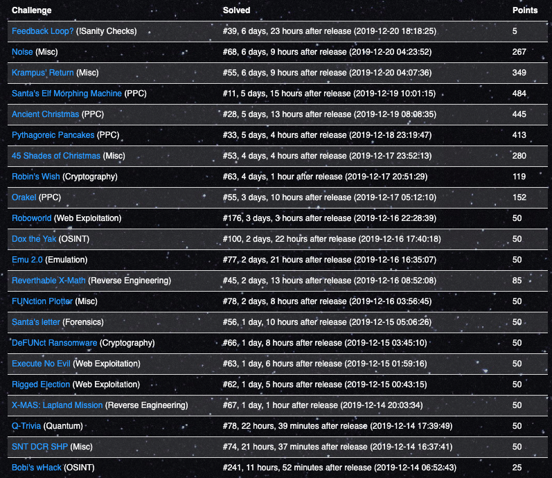

# Overview

[X-MAS CTF 2019](https://ctftime.org/event/926) was a 1 week long online CTF, hosted by team [HTsP](https://ctftime.org/team/58218). There were a ton of fun problems and experimental categories, like Quantum, Emulators, and Open Source Intelligence (OSINT).

It was also my first CTF! I played solo and was pretty happy with my results, ending in 53rd place out of 2000+ participating teams. My score breadown below makes it clear that I have a lot to learn in some areas of security/hacking.

# Writeups

While "Lapland Mission" and "Emu 2.0" were some of my favorite challenges, I've chosen writeups that were interesting or difficult to share. Hope you enjoy!

- [Robin's Wish [Crypto, 119 points]](crypto/robins_wish/README.md)
- [45 Shades of Christmas [Misc, 280 points]](misc/45_shades_of_christmas/README.md)
- [Krampus' Return [Misc, 349 points]](misc/krampus_return/README.md)
- [Ancient Christmas [PPC, 445 points]](ppc/ancient_christmas/README.md)

# Score

