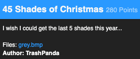

# Problem [Misc, 280 Points]



This was a simple problem but it required some guessing and attention to detail to puzzle out.

# Resources

- [Base 64](https://en.wikipedia.org/wiki/Base64)

# Solution

## TLDR

Map gray pixels to ASCII based on pixel values, arrange into a grid and recognize the Base64 string hiding there.

## Solution

I like the subtle hints in this problem. The problem statement suggests that there are 45 shades of gray, but if you check there are actually 59, made up of:

- Most uppercase ascii characters
- Most lowercase ascii characters
- Digits from 0-9
- The `=` symbol

For a while I was hung up on the fact that 4 of the missing characters were qrKP, which I thought were chess pieces. I tried to visualize a 45x45 grid showing only chess pieces `kqrnbpKQRNBP` and `=` since it's plausible there were chess moves like `e8=Q`:

```
                  B   R b         R   Q b N  
 R     b     B b                     R  nR   
            B            p   n           pb  
            p          B       B R       b   
       n  B b B             b B   B   R      
   Q  p  Rp         nB     b       b B       
    Bk    b B     Q k       B b   b        n 
       B           B b     B         b N b   
  B       B b             N   Q b   b        
     R   B   R   B   B       R       N       
  b       b     R        p  B       B   B    
 b     B       Q    n          B       R     
R                          k               kN
             B    kQ         B     b   b Q   
    N            p  Q     b         B   N   N
 R B    p                  B           B   Bk
    b Npb     N       R               B b B  
     B   B       B     b  p      k   B b   Q 
         p n            B             b      
   B   R b R b     N    Q  B    k  R      nBp
  B   R  nN  nRpb   b Bn      B   B       R  
   b     R         b     B b B       B   N   
    B   B                   B   R    p  B   p
   B        p  B       R   B b         B b   
      k           p         b            nB b
   b B Q R           R     b   b B       R   
            k   B b B       Q  nB        p  B
 b Np      B      nB     b     Q         b Rn
b              k      B   N   N b  n  R  n NR
   b B       B   R             b R        pQ 
B b R b    n       n    R     b N    n  B   B
  n  b     R      nR                n       k
  Q       N   B   k   B b         B   B   R  
   b  k      R   B       Q b         Q   BpR 
     k   p          B   N           N      k 
   B   R   B       Bpb B         b       b   
    Q              B      R b B   B b      B 
             R     b         B         b  pR 
 kb                 Bk  N       B    kb     R
   p b N   B b     Q   R       N       B   B 
b             B   N b                     k  
  n              B       B   N b            Q
 p      B      nB               B     b     =
   B       R   k     p B     b      k       =
  Q       Q             b     B             =
```

No clear pattern here but those `=`s at the end are very interesting. They seem like padding for a base64 string! I first tried decoding three strings made up of every third line, but that failed. Next I tried decoding it from left to right, top to bottom:

```
import base64
import cv2
import string

image = cv2.imread('grey.bmp', cv2.IMREAD_GRAYSCALE)
print()
result = ''
for i in range(45):
	for val in image[:,i]:
		result += chr(val)

print(base64.b64decode(result))
```

Output:

```
b"Our Fore-Fathers, when the common Devices of Eve were over, and Night was come on, were wont to light up Candles of an uncommon Size, which were called Christmas-Candles, and to lay a Log of Wood upon the Fire, which they termed a Yule-Clog, or Christmas-Block. These were to Illuminate the House, and turn the Night into Day; which custom, in some Measure, is still kept up in the Northern Parts. It hath, in all probability, been derived from the Saxons. For Bede tells us, That [sic] this very Night was observed in this Land before, by the Heathen Saxons. They began, says he, their Year on the Eight of the Calenders of January, which is now our Christmas Party: And the very Night before, which is now Holy to us, was by them called M\xc3\xa6drenack, or the Night of the Mothers The Yule-Clog therefore hath probably been a Part of those Ceremonies which were perform'd that Night's Ceremonies. It seems to have been used, as an Emblem of the return of the Sun, and the lengthening of the Days. For as both December and January were called Guili or Yule, upon Account of the Sun's Returning, and the Increase of the Days; so, I am apt to believe, the Log has had the Name of the Yule-Log, from its being burnt as an Emblem of the returning Sun, and the Increase of its Light and Heat. This was probably the Reason of the custom among the Heathen Saxons; but I cannot think the Observation of it was continued for the same Reason, after Christianity was embraced. YA CHRISTMAS FLAG IS : X-MAS{Gl43d3ligJul0gG0dtNyt4r}"
```

The flag is `X-MAS{Gl43d3ligJul0gG0dtNyt4r}`!
