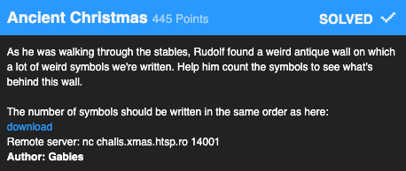
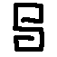
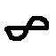
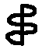
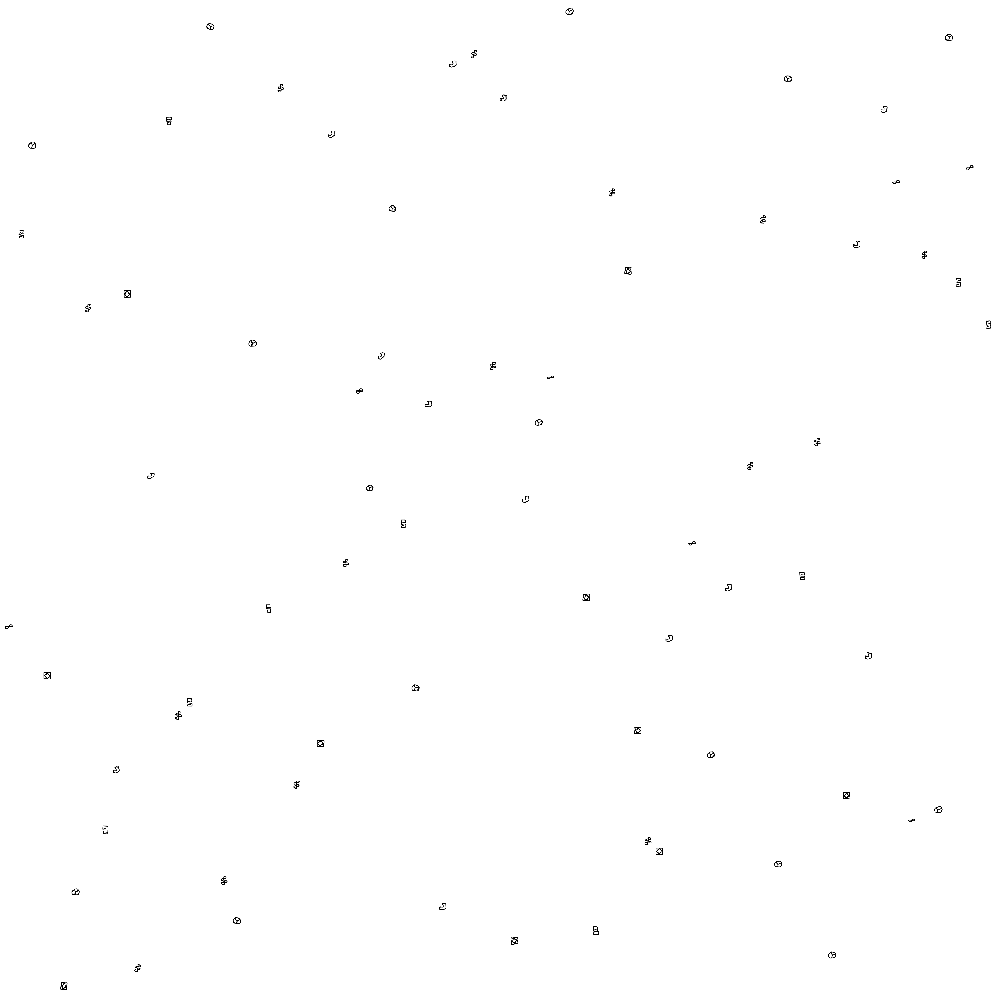
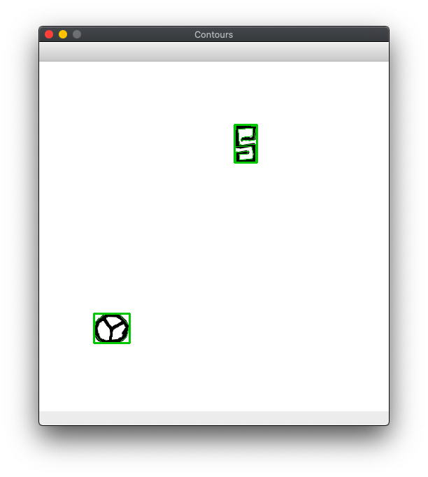
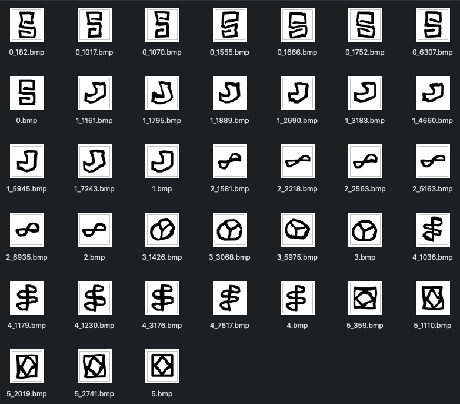

# Problem



# Resources

- [Finding Bounding Rectangles in OpenCV2](https://docs.opencv.org/3.4/da/d0c/tutorial_bounding_rects_circles.html)
- [Training a CNN in Keras](https://www.analyticsvidhya.com/blog/2019/01/build-image-classification-model-10-minutes/)
- [File Deduplicator App](https://macpaw.com/gemini)

# Solution

This problem was essentially a fun intro to image processing. When you download the six images, you find they are all 63x63 greyscale BMPs:








How kind of the organizers to keep it simple. :) But they didn't make it *that* simple:



For 10 "challenge" images in a row like the one above, you had 30 seconds to return a comma-separated list of how many of the symbols from 0-6 were in the image. This was too fast for me to do manually, so I had to automate it.

## Approach #1: Template Matching

Since I Was provided 6 sample images, my initial attempts tried to extract 63x63 images from the challenge, centered around each symbol. I would then compare those images to the templates to categorize them.

I wrote a largely [copy/pasted](https://docs.opencv.org/3.4/da/d0c/tutorial_bounding_rects_circles.html) function to extract bounding rectangles from the image:

```
def load_image(filename):
	im = cv2.imread(filename, cv2.IMREAD_GRAYSCALE)
	ret, thresh = cv2.threshold(im, 127, 255, cv2.THRESH_BINARY_INV)
	contours, hierarchy = cv2.findContours(thresh, cv2.RETR_EXTERNAL, cv2.CHAIN_APPROX_SIMPLE)

	contours_poly = [None]*len(contours)
	boundRect = [None]*len(contours)
	for i, c in enumerate(contours):
	    contours_poly[i] = cv2.approxPolyDP(c, 3, True)
	    boundRect[i] = cv2.boundingRect(contours_poly[i])


	points = []
	for i in range(len(contours)):
		x, y, width, height = boundRect[i]
		points.append((x + width // 2, y + height // 2, aspect_ratio))

	return im, points
```

This worked better than I expected, and this code didn't really change in my final solution. 



I also had a small function that would extract a 63x63 "patch" of the image, centered around the center of the bounding rectangle:

```
for x, y in points:
	patch = im[y - 31 : y + 32, x - 31 : x + 32]
```

Unfortunately, my attempts to do template comparison failed horribly. I tried using dot products between the template image and the challenge image to measure similarity, but the performance was far under the near 100% accuracy required to pass the challenge. As many do in such a situation, I turned to machine learning.

## Approach #2: Have a CNN Memorize the Dataset

I already had scripts that were creating 63x63 challenge images, now I just needed to save them. I started farming images from the challenges and labeling hundreds of them by hand. I then [copied code](https://www.analyticsvidhya.com/blog/2019/01/build-image-classification-model-10-minutes/) to train a CNN with Keras and started using my model for predictions.

```
def get_train_files():
	train_files = []
	for filename in os.listdir('images/'):
		if '_' not in filename:
			continue
		label = filename.split('_')[0]
		train_files.append((filename, label))

	return train_files


def train():
	train_files = get_train_files()
	train_image = []
	for i in range(len(train_files)):
	    img = image.load_img('images/' + train_files[i][0], target_size=(63,63,1), grayscale=True)
	    img = image.img_to_array(img)
	    img = img/255
	    train_image.append(img)

	X = np.array(train_image)
	y=pd.Series([t[1] for t in train_files])
	y = to_categorical(y)

	X_train, X_test, y_train, y_test = train_test_split(X, y, random_state=42, test_size=0.2)

	model = Sequential()
	model.add(Conv2D(32, kernel_size=(3, 3),activation='relu',input_shape=(63,63,1)))
	model.add(Conv2D(64, (3, 3), activation='relu'))
	model.add(MaxPooling2D(pool_size=(2, 2)))
	model.add(Dropout(0.25))
	model.add(Flatten())
	model.add(Dense(128, activation='relu'))
	model.add(Dropout(0.5))
	model.add(Dense(6, activation='softmax'))

	model.compile(loss='categorical_crossentropy',optimizer='Adam',metrics=['accuracy'])

	model.fit(X_train, y_train, epochs=10, validation_data=(X_test, y_test))
	model.save('model.hdf5')
```

It didn't quite work. The training accuracy was 97% but the images the model hadn't learned were still causing me to fail enough challenges. The model was overfitting to duplicate images that I was farming multiple times over. Luckily, my Setapp subscription gives me access to a file deduplication app called [Gemini](https://macpaw.com/gemini), which I pointed at my image folder to clean out the extras. I was surprised to find that the set of images was fairly small:



I retrained my model just on these and achieved 100% training accuracy, which alloewd me to complete the challenge.

```
Sending counts_string: 0,1,0,0,1,1
Sending counts_string: 1,2,2,0,1,0
Sending counts_string: 0,1,4,3,0,4
Sending counts_string: 5,2,3,4,4,3
Sending counts_string: 6,6,4,4,5,4
Sending counts_string: 7,7,5,6,7,4
Sending counts_string: 7,6,8,10,5,9
Sending counts_string: 11,8,13,6,6,10
Sending counts_string: 12,11,16,12,3,9
Sending counts_string: 15,10,8,16,9,14
Well done! Next one.
Congratulations, you are now a symbol recognition master!
Here's your flag: X-MAS{D0_y0u_1ik3_my_h0l35?}
```

Flag: `X-MAS{D0_y0u_1ik3_my_h0l35?}`
